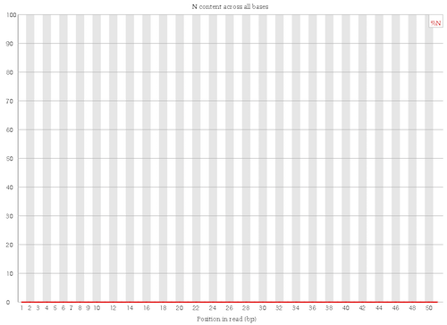
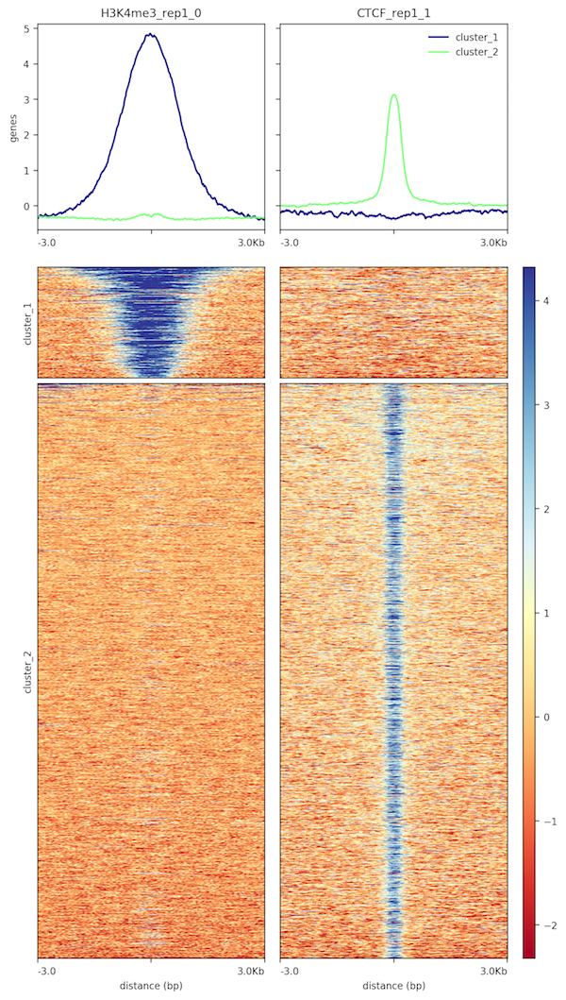
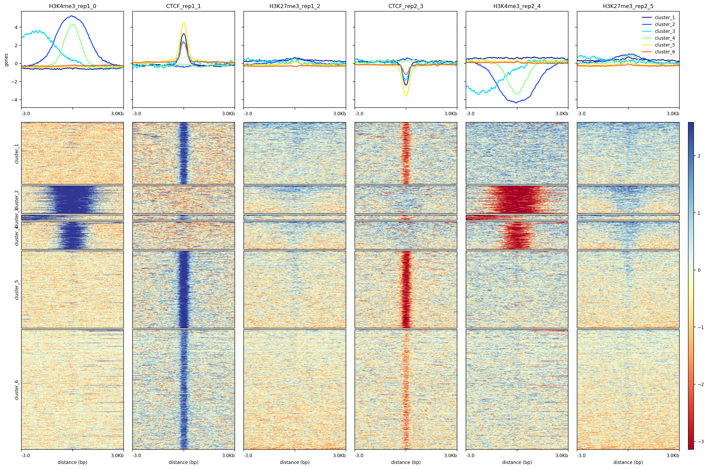
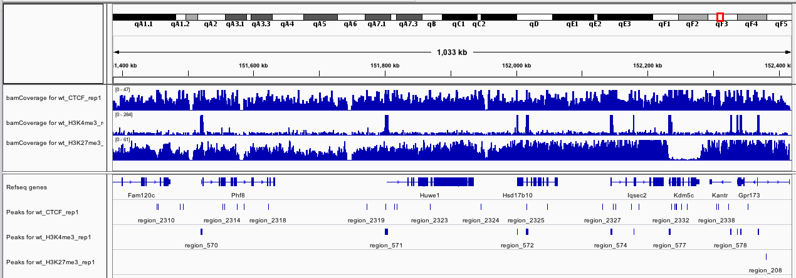

# Introduction

Within a cell nucleus, the DNA is tightly-packed and the chromatin is spatially distributed with different levels and scales of organizations. At the smallest scale, DNA is packaged into units called nucleosomes, made of eight histone proteins.


Transcription factors (TFs) in concert with histone modifications shape the chromatin landscape of the genome, and thus regulate cell types and cell states. Histone modifications form an adaptable epigenetic regulatory layer that mediate dynamic transcriptional programs. Functional genomics assays, the most popular involving chromatin immunoprecipitation (ChIP), have revealed active and repressive chromatin structures in bulk tissues. However, inefficiencies of ChIP hinder its application in single cells, preventing genome-wide analysis of histone modifications along the continuum of cellular phenotypes. Therefore, how chromatin landscapes change between repressed, poised, and active states during development and homeostasis is relatively unexplored at the single-cell level.

Binding certain proteins to each of the eight histone proteins may modify the chromatin structure and may result in changes in transcription level. For example, the H3K4me3 is adding 3 methyl-group of the 4th Lysine in the histone 3 amino-acid. This modification is known to activate the transcription on nearby genes by opening the chromatin. The H3K27me3 on the other hand is inactivating the transcription of the nearby genes:


In the upcoming tutorial, we will look at H3K4me3 scChIC-seq data from mouse bone marrow and see how we can do preliminary analyses to see how histone modification levels differ between cell types. We have prepared the files such that the individual cells are grouped into three clusters based on three cell types: erythroblasts, lymphocytes, and granulocytes. Your job is to infer which cluster corresponds to which cell type.


- TODO: Add Sample names here


# Step 1: Quality control and treatment of the sequences

Let's first assess the quality of the demultiplexed `fastq` files. Demultiplexed means UMI and cell barcodes have been clipped from the `fastq` file and placed in the header.

> ### Hands-on: First look at the `fastq` files
> 1. Import `demultiplexedR1_10000rows.fastq.gz` and `demultiplexedR2_10000rows.fastq.gz` from [Zenodo](https://zenodo.org/record/1324070) or from the data library (ask your instructor)
>
>    ```
>    https://zenodo.org/record/3256371/files/H3K4me3_cluster_3.filtered_R1.fastq
>    https://zenodo.org/record/3256371/files/H3K4me3_cluster_3.filtered_R2.fastq
>    ```
>
> 2. Rename the files to `H3K4me3_demultiplexedR1_10000rows.fastq.gz` and `H3K4me3_demultiplexedR2_10000rows.fastq.gz`
>
> 3. Inspect the `fastq` file by using the `less` command
>

During sequencing, errors are introduced, such as incorrect nucleotides being called. These are due to the technical limitations of each sequencing platform. Sequencing errors might bias the analysis and can lead to a misinterpretation of the data.

Sequence quality control is therefore an essential first step in your analysis. We use here similar tools as described in ["Quality control" tutorial]({{site.baseurl}}/topics/sequence-analysis): [FastQC](https://www.bioinformatics.babraham.ac.uk/projects/fastqc/). Interpretation of fastqc outputs can be found here [FastQC Output](http://www.bioinformatics.babraham.ac.uk/projects/fastqc/Help/3%20Analysis%20Modules/).


> ### Hands-on: Quality control
>
> 1. Run **FastQC** on the fastq files
>    - `fastqc H3K4me3_demultiplexedR1_10000rows.fastq.gz` and `fastqc H3K4me3_demultiplexedR2_10000rows.fastq.gz`
> 2. Inspect the generated HTML files
>
>    > ### Questions
>    >
>    > 1. How is the quality of the reads in `H3K4me3_demultiplexedR1_10000rows.fastq.gz`?
>    > 2. And in `H3K4me3_demultiplexedR2_10000rows.fastq.gz`?
>    > 3. Why do the lengths of the bases differ? Hint: Remember that the `fastq` files have been demultiplexed.
>    > 4. What should we do if the quality of the reads is not good?
>    > 5. What are the most common start sequences for the `fastq` files? How does it differ for `R1` and `R2`?
>    >
>    > > ### Solution
>    > > 1. The reads in `H3K4me3_demultiplexedR1_10000rows.fastq.gz` are of good quality
>    > >     - The mean quality score over the reads is quite high
>    > >
>    > >
>    > >
>    > >
>    > >
>    > >
>    > >
>    > >     - No N in the reads
>    > >
>    > >        
>    > >
>    > >     - No duplicated sequences
>    > >
>    > >        
>    > >
>    > >    
>    > >
>    > >        
>    > >
>    > > 2. The reads in R2 are a bit worse:
>    > >
>    > >
>    > > 3. If the quality of the reads is not good, we should:
>    > >    1. Check what is wrong and think about it: it may come from the type of sequencing or what we sequenced (high quantity of overrepresented sequences in transcriptomics data, biaised percentage of bases in HiC data)
>    > >    2. Ask the sequencing facility about it
>    > >    3. Perform some quality treatment (in a reasonable way to not loose too much information) with some trimming or removal of bad reads
>    > > 4. TODO:
>

# Step 2: Mapping of the reads

We obtain sequences corresponding to a portion of DNA linked to the histone mark of interest, H3K4me3 in this case. H3K4me3 is associated with active chromatin. It would be interesting to know if there is a difference across cell types.



## Running BWA

> ### Hands-on: Mapping
>
> 1. Run bwa on the fastq files, using an mm10 reference genome.
> TODO Add reference index files into the server.
>
> `bwa mem -t 1 $ref ${f}_R1.fastq.gz ${f}__R2.fastq.gz | samtools view -b - > $outf`
>
> 2. Inspect the mapping stats
>
>    > ### Questions
>    >
>.   > How do you view the aligned reads?
>.   > How do we see the length of each chromosome used in the mapping? Hint: see header in samtools
>    > How many reads where mapped? Uniquely or several times?
>    >

The output of BWA is a BAM file (binary of Sequence Alignment/Map).

## Inspection of a BAM file

TODO Add more things to inspect.


## Correlation between samples

We will compare genome-wide correlation of H3K4me3 and H3K4me1 for different cell clusters.

To compute the correlation between the samples we are going to to use the QC modules of [deepTools](http://deeptools.readthedocs.io/), a software package for the QC, processing and analysis of NGS data. Before computing the correlation a time consuming step is required, which is to compute the read coverage (number of unique reads mapped at a given nucleotide) over a large number of regions from each of the inputed BAM files. For this we will use the tool **multiBamSummary** . Then, we use **plotCorrelation**  from deepTools to compute and visualize the sample correlation. This is a fast process that allows to quickly try different color combinations and outputs.

Since in this tutorial we are interested in assessing H3K4me3 and H3K4me1 scChIC-seq samples. To save time, we have already done that and summarized the scChIC-seq data as bigwig files, which contains the read coverage.

> ### Hands-on: Correlation between samples
>
> 1. Download the read coverage files `bigwig`.
>
> 2. Rename the files
> 3. Compare bigwigs using `multiBigwigSummary`
>    - *"Sample order matters"*: `No`
>       -  *"BAM/CRAM file"*: the 8 imported BAM files
>    - *"Choose computation mode"*: `Bins`
>       - *"Bin size in bp"*: `100000`
>
>
>    Using these parameters, the tool will take bins of 100000 bp. For each bin the overlapping reads in each sample will be computed and stored into a matrix.
>
> 4. **plotCorrelation** with the following parameters
>    - *"Correlation method"*: `Spearman`
>    - Plot `heatmap` or `scatterplot`.
>.   - Plot output in log scale (--log1p)
>
>    

> ### Questions
>
> From the correlation plot, can you infer which clusters correspond to the same cell type in H3K4me1 and H3K4me3?
>

# Step 4: Exploring `bam` and `bigwig` files on the IGV browser

The bam file contains only reads falling in specific genomic regions, in order to reduce the file size.

Cell-type specific regions to look at:

```
chr7    114972165       116898716
chr7    103325741       104425479
chr3    90523036        90870443
chr11   44114099        45269522
```


> ### Questions:
>     1. Can you infer which clusters correspond to which cell types based on the coverage around the four regions?
>

# Step 5: Detecting enriched regions (peak calling)

We could see in the scChIC-seq data some enriched regions that differ across samples. We now would like to call these regions to obtain their coordinates, using **MACS2 callpeak** 

> ###  Hands-on: Peak calling
>
> 1. **MACS2 callpeak**  with the following parameters
>    - *"Are you pooling Treatment Files?"*: `No`
>       -  *"ChIP-Seq Treatment File"*: `wt_H3K4me3_rep1.bam`
>    - *"Do you have a Control File?"*: `Yes`
>       - *"Are you pooling Treatment Files?"*: `No`
>           -  *"ChIP-Seq Treatment File"*: `wt_input_rep1.bam`
>    - *"Format of Input Files"*: `Paired-end BAM`
>    - *"Effective genome size"*: `M.musculus (1.87e9)`
>    - *"Outputs"*: `Summary page (html)`
>
>    > ###  Comments
>    > The advanced options may be adjusted, depending of the samples.
>    > If your ChIP-seq experiment targets regions of broad enrichment, *e.g.* non-punctuate histone modifications, select calling of broad regions.
>    > If your sample has a low duplication rate (*e.g.* below 10%), you might keep all duplicate reads (tags). Otherwise, you might use the 'auto' option to estimate the maximal allowed number of duplicated reads per genomic location.
>    {: .comment}
>
> 2. Inspect the  `(narrow Peaks)` file (output of **MACS2 callpeak** )
>
>    > ###  Questions
>    >
>    > Which type of files were generated? What do they include?
>    >
>    > > ###  Solution
>    > > **MACS2 callpeak**  has generated a bed file with the coordinates of the identified peaks: chromosome, start, stop, name, integer score, strand, fold-change, -log10pvalue, -log10qvalue and relative summit position to peak start, as well as a html report which contains links to additional bed and xls files.
>    > {: .solution }
>    {: .question}
>
> 3. **IGV**  to inspect with the signal coverage and log2 ratio tracks
>
{: .hands_on}

> ###  Questions
>
> 1. How many peaks have been identified in `chrX:151,385,260-152,426,526` based on IGV?
>
>    
>
> 2. What are the fold change of the peaks identified in `chrX:151,385,260-152,426,526`? Hint: using the BED file
> 3. How many peaks have been identified on the full chromosome X? How many peaks have a fold change > 50?
>
> > ###  Solution
> > 1. We can see 11 peaks (track below the genes).
> > 2. Using **Filter**  with `c2>151385260 and c3<152426526`, we found that the 11 peaks with fold changes between 3.81927 and 162.06572
> > 4. On the 656 peaks on the full chromosome (number of lines of the original BED file) there are 252 peaks with FC>50 (using **Filter**  with `c7>50`)
> {: .solution }
{: .question}

The called peak regions can be filtered by, *e.g.* fold change, FDR and region length for further downstream analysis.

# Step 6: Plot the signal between samples

So far, we have normalized the data and identified peaks. Now, we would like to visualize scores associated with certain genomic regions, for example ChIP enrichment values around the TSS of genes. Moreover, we would like to compare the enrichment of several ChIP samples (e.g. CTCF and H3K4me3 )on the regions of interest.

Since we already generated the required files for the H3K4me3 sample, let's make them only for the CTCF sample:

> ###  Hands-on: Prepare the peaks and data for CTCF
>
> 1. **bamCompare**  with the following parameters
>    -  *"First BAM file (e.g. treated sample)"*: `wt_CTCF_rep1.bam`
>    -  *"Second BAM file (e.g. control sample)"*: `wt_input_rep1.bam`
>    - *"Bin size in bases"*: `50`
>    - *"How to compare the two files"*: `Compute log2 of the number of reads ratio`
>    - *"Coverage file format"*: `bigwig`
>    - *"Region of the genome to limit the operation to"*: `chrX`
> 2. Rename the output of **bamCompare**  with the name of the sample
> 3. **MACS2 callpeak**  with the following parameters
>    - *"Are you pooling Treatment Files?"*: `No`
>       -  *"ChIP-Seq Treatment File"*: `wt_CTCF_rep1.bam`
>    - *"Do you have a Control File?"*: `Yes`
>       - *"Are you pooling Treatment Files?"*: `No`
>           -  *"ChIP-Seq Treatment File"*: `wt_input_rep1.bam`
>    - *"Format of Input Files"*: `Paired-end BAM`
>    - *"Effective genome size"*: `M.musculus (1.87e9)`
>
{: .hands_on}

We can now concatenate the MACS2 outputs with the location of the peaks (concatenate the files and merge the overlapping regions) to obtain one BED file corresponding to the coordinates of the interesting regions to plot.

> ###  Hands-on: Prepare the peak coordinates
>
> 1. **Concatenate two datasets into one dataset**  with the following parameters
>    -  *"Concatenate"*: output of **MACS2 callpeak**  for `wt_CTCF_rep1`
>    -  *"with"*: output of **MACS2 callpeak**  for `wt_H3K4me3_rep1`
> 2. **SortBED**  with the following parameters
>    -  *"Sort the following bed,bedgraph,gff,vcf file"*: output of **Concatenate** 
> 3. **MergeBED**  with the following parameters
>    -  *"Sort the following bed,bedgraph,gff,vcf file"*: output of **SortBED** 
>
{: .hands_on}

To plot the the peaks score on the region generated above (MergeBED output) two tools from the [deepTools](http://deeptools.readthedocs.io/) package are used:
- **computeMatrix** : it computes the signal on given regions, using the `bigwig` coverage files from different samples.
- **plotHeatmap** : it plots heatMap of the signals using the **computeMatrix**  output.

Optionally, we can also use **plotProfile**  to create a profile plot from **computeMatrix**  output.

> ###  Hands-on: Plot the heatmap
>
> 1. **computeMatrix**  with the following parameters:
>    - *"Select regions"*:
>       -  *"Regions to plot"*: output of **MergeBED** 
>    - *"Sample order matters"*: `No`
>       -  *"Score file"*: the 2 `bigwig` files generated by **bamCompare**  and renamed
>    - *"computeMatrix has two main output options"*: `reference-point`
>       - *"The reference point for the plotting"*: `center of region`
>       - *"Distance upstream of the start site of the regions defined in the region file"*: `3000`
>       - *"Distance downstream of the end site of the given regions"*: `3000`
> 2. **plotHeatmap**  with the following parameters
>    -  *"Matrix file from the computeMatrix tool"*: `Matrix` (output of **computeMatrix** )
>    - *"Show advanced options"*: `yes`
>       - *"Reference point label"*: select the right label
>       - *"Did you compute the matrix with more than one groups of regions?"*: `No, I used only one group`
>           - *"Clustering algorithm"*: `Kmeans clustering`
>           - *"Number of clusters to compute"*: `2`
{: .hands_on}

It should generate an heatmap similar to:



When we look at this graph, it seems that less but larger peaks are found for `H3K4me3_rep1` and that only few peaks are shared.

> ###  Questions
>
> 1. How many peaks have been found for `CTCF_rep1` and for `H3K4me3_rep1`?
> 2. What are the mean width of the peaks for `CTCF_rep1` and for `H3K4me3_rep1`?
> 3. How many peaks are specific to `CTCF_rep1` or `H3K4me3_rep1`?
>
> > ###  Solution
> > 1. 656 peaks for `H3K4me3_rep1` and 2,688 for `CTCF_rep1` (number of lines in the **MACS2 callpeak**  BED file)
> > 2. 1630.77 bp for `H3K4me3_rep1` and 404.55 for `CTCF_rep1` (**Compute**  with `c3-c2` and then **Datamash**  with `Mean` on `Column:11`)
> > 3. 443 peaks (over 656) are specific to `H3K4me3_rep1` and 2,464 (over 2,688) to `CTCF_rep1` (**Intersect intervals** ). Around 220 peaks are then overlapping.
> {: .solution }
{: .question}

So far, we have only analyzed 2 samples, but we can do the same for all the 6 samples:

> ###  (Optional) Hands-on: Plot the heatmap for all the samples
>
> 1. **bamCompare**  for each combination input - ChIP data:
>     1. `wt_CTCF_rep1` - `wt_input_rep1` (already done)
>     2. `wt_H3K4me3_rep1` - `wt_input_rep1` (already done)
>     3. `wt_H3K27me3_rep1` - `wt_input_rep1`
>     4. `wt_CTCF_rep2` - `wt_input_rep2`
>     5. `wt_H3K4me3_rep2` - `wt_input_rep2`
>     6. `wt_H3K27me3_rep2` - `wt_input_rep2`
> 2. Rename the outputs of **bamCompare**  with the name of the ChIP data
> 3. **MACS2 callpeak**  for each combination input - ChIP data
> 4. **Concatenate datasets tail-to-head**  with the following parameters
>     -  *"Concatenate Dataset"*: one output of **MACS2 callpeak** 
>     - Click *"Insert Dataset"* and  *"Select"* one other output of **MACS2 callpeak** 
>     - Redo for the 6 outputs of **MACS2 callpeak** 
> 5. **SortBED**  with the following parameters
>    -  *"Sort the following bed,bedgraph,gff,vcf file"*: output of **Concatenate** 
> 6. **MergeBED**  with the following parameters
>    -  *"Sort the following bed,bedgraph,gff,vcf file"*: output of **SortBED** 
> 7. **computeMatrix**  with the same parameters but:
>    - *"Select regions"*:
>       -  *"Regions to plot"*: output of **MergeBED** 
>    - *"Sample order matters"*: `No`
>       -  *"Score file"*: the 6 `bigwig` files generated by **bamCompare**  and renamed
>    - *"computeMatrix has two main output options"*: `reference-point`
>       - *"The reference point for the plotting"*: `center of region`
>       - *"Distance upstream of the start site of the regions defined in the region file"*: `3000`
>       - *"Distance downstream of the end site of the given regions"*: `3000`
> 8. **plotHeatmap**  with the following parameters
>    -  *"Matrix file from the computeMatrix tool"*: `Matrix` (output of **computeMatrix** )
>    - *"Show advanced options"*: `yes`
>       - *"Reference point label"*: select the right label
>       - *"Did you compute the matrix with more than one groups of regions?"*: `No, I used only one group`
>           - *"Clustering algorithm"*: `Kmeans clustering`
>           - *"Number of clusters to compute"*: `2`
{: .hands_on}

> ###  Questions
>
> 1. How many peaks are found for the different samples?
> 2. How are the peaks?
>
>    
>
> 3. How could be interpreted the peaks and read coverage in the `chrX:151,385,260-152,426,526` region?
>
>    
>
> > ###  Solution
> > 1. Found peaks (number of lines in **MACS2 callpeak**  outputs):
> >
> >     Target | Rep 1 | Rep 2
> >     --- | --- | ---
> >     CTCF | 2,688 | 2,062
> >     H3K4me3 | 656 | 717
> >     H3K27me3 | 221 | 76
> >
> >    The tendencies are similar for both replicates: more peaks for CTCF, less for H3K4me3 and only few for H3K27me3.
> >
> > 2. As observed with the 2 samples, the peaks for H3K4me3 are wider than for CTCF. We also observe that the peaks found with one replicate are found with the other replicate.
> > 3. The H3K4me3 sample has clear and large regions in which the read coverage are enriched. H3K4me3 is one of the least abundant histone modifications. It is highly enriched at active promoters near transcription start sites (TSS) and positively correlated with transcription.
> >
> >    For H3K27me3, the coverage is more homogeneous. A gene is a broad domain of H3K27me3 enrichment across its body of genes corresponds to a gene with a transcription inhibited by H3K27me3. We can also identified some "bivalent" genes: gene with a peak around the TSS for H3K27me3(e.g. region_208 for gene Gpr173) but also H3K4me3. We also observe some H3K27me3-depleted regions sharply demarcated, with boundaries coinciding with gene borders (e.g. Kdm5c). This is a chromatin signature reminiscent of genes that escape XCI.
> >
> >    To reproduce, run **bamCoverage** , **IGV**  and **MACS2 callpeak**  outputs.
> {: .solution }
{: .question}

# Conclusion
{:.no_toc}

Along this tutorial, we learn how to extract peaks and coverage information from raw data of ChIP experiments:


This information can be then related to the biology to answer the original question. We tried then to relate the observed differences of peak and read coverage between H3K27me3 and H3K4me3 to the known biology. We could go even further in the analysis to reproduce the results of the original paper (e.g. by looking at the bivalent genes, identifying the differences between Xa and Xi).
